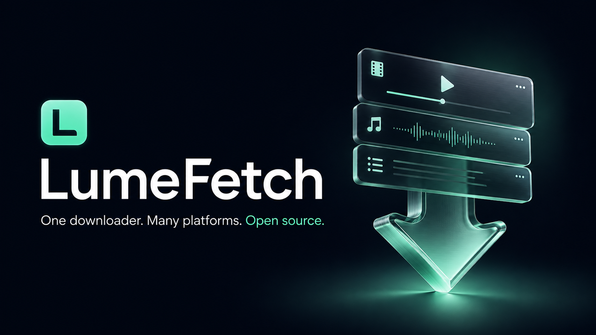
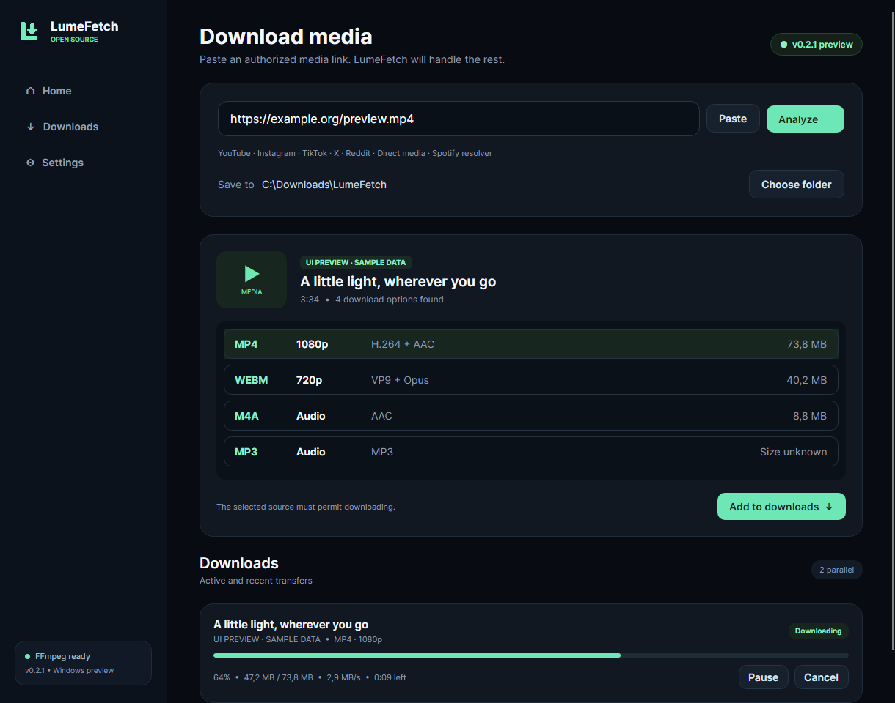
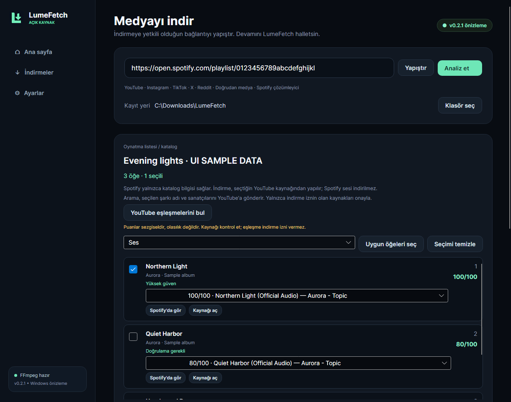
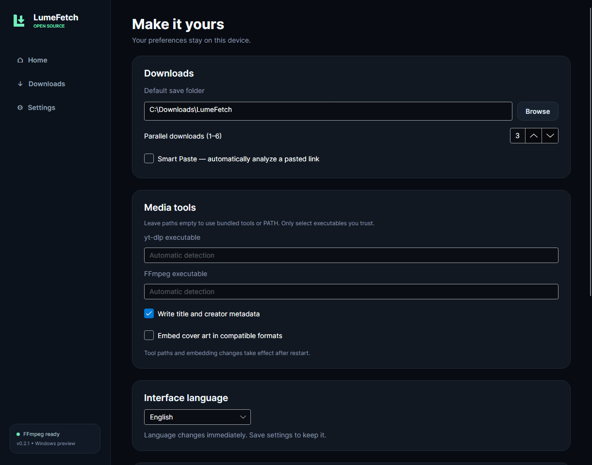

# LumeFetch



**One downloader. Many platforms. Open source.**

[Website](https://ruzgarefe.com) · [Source](https://github.com/Ranbon-Kafa/LumeFetch) ·
[Releases](https://github.com/Ranbon-Kafa/LumeFetch/releases) ·
[Report an issue](https://github.com/Ranbon-Kafa/LumeFetch/issues)

Maintained by **Ranbon-Kafa / ruzgarefe.com** and the LumeFetch contributors.

LumeFetch is a modern, cross-platform media download manager built with C#,
.NET, Avalonia UI, and FFmpeg. Paste a supported URL, inspect the available
formats, and add an authorized download to a managed queue.

> [!IMPORTANT]
> LumeFetch is intended only for media you own, media you are authorized to
> download, or media whose terms permit downloading. It does not bypass DRM,
> paywalls, authentication controls, or other access restrictions.

## Project status

LumeFetch v0.2.1 is a Windows-first preview with six providers, YouTube playlists,
a Spotify-to-YouTube resolver, Turkish/English UI, a managed download queue,
persistent settings, FFmpeg integration, and self-contained Windows packages.
The UI and media pipeline run; social-site availability still depends on upstream
extractors and each site's public-access rules.

**Initial GitHub publication is a source-code preview.** Prebuilt installers
containing third-party tools are not public release assets yet; see the
[release checklist](docs/RELEASE-CHECKLIST.md). Build instructions and packaging
scripts are included for developers.



*Actual Avalonia render with explicitly labeled sample data, not a live download.*

| Source | Role | v0.2.1 status |
|---|---|---|
| Direct HTTP/media URL | Provider | Implemented |
| YouTube / YouTube Music | Provider + collection expansion | Single videos and playlists via yt-dlp |
| Instagram | Provider | Implemented via yt-dlp; public single video/reel |
| TikTok | Provider | Implemented via yt-dlp; public single video |
| X / Twitter | Provider | Implemented via yt-dlp; single-video post |
| Reddit | Provider | Implemented via yt-dlp; single-video post |
| Facebook, Twitch, Vimeo | Provider | Backlog |
| Spotify | Metadata resolver | Track/album/owned or collaborative playlist → YouTube; own Client ID/login required |

## Playlists and Spotify

Paste a YouTube/YouTube Music playlist, choose items and a batch quality,
confirm download permission, then queue the selection. Each item is analyzed
individually; unavailable items remain visible and one failure does not stop
the rest. Up to 200 entries are shown in this preview. Video presets never
silently exceed their resolution cap.

For audio, choose the **MP3** row in the main format list, or **MP3 audio** in
the playlist/Spotify batch selector. FFmpeg encodes actual MP3 audio using
high-quality variable bitrate; this is not a fixed 320 kbps promise and cannot
improve the original recording. Conversion size is unknown until processing.
Direct HTTP video/audio links also offer MP3 conversion when FFmpeg is available.
Silent or incompatible direct-media files fail clearly rather than producing
a renamed non-MP3 file.

Spotify provides metadata, **not audio**. Connect in Settings, paste a track,
album or accessible playlist, then choose **Find YouTube matches**. Review the
candidate source and score before queuing. Tracks scoring 90+ are preselected;
70–89 and lower scores require manual selection. No match means no download.
Search sends the selected titles/artists to YouTube; it does not upload tokens.



Read [Spotify setup and limitations](docs/SPOTIFY.md). The integration is
experimental, uses your own developer Client ID with PKCE and never requests a
client secret. Real-account access and public-distribution policy approval are
not established by our offline tests.

## Architecture

```text
URL -> MediaAnalysisService -> ProviderRegistry -> IMediaProvider
                                      |
                                      v
                              MediaInfo + options
                                      |
                                      v
                             DownloadManager queue
                                      |
                                      v
                          Provider -> FFmpeg processing
```

- `LumeFetch.Core` contains contracts, media models, provider selection, and
  the download queue. It has no UI or platform-specific dependencies.
- `LumeFetch.Infrastructure` contains HTTP downloading and external-tool
  adapters such as FFmpeg.
- `LumeFetch.Desktop` is the Avalonia composition root and presentation layer.
- `LumeFetch.Core.Tests` verifies provider routing and queue behavior.

Providers download media. Resolvers translate catalog links (for example,
Spotify) into match candidates and never pretend to be download sources. See
[Architecture](docs/ARCHITECTURE.md) for the full decision record.

## Build from source

Prerequisites:

- .NET 10 SDK (LTS)
- Windows 10/11, Linux, or macOS
- FFmpeg on `PATH` for merge/transcode operations
- yt-dlp on `PATH` for YouTube / YouTube Music
- Deno for YouTube's supported JavaScript extraction path

```powershell
dotnet restore LumeFetch.sln
dotnet build LumeFetch.sln --configuration Release
dotnet test LumeFetch.sln --configuration Release
dotnet run --project src/LumeFetch.Desktop
```

During Windows development, run `./scripts/Get-WindowsTools.ps1` to download
pinned, SHA-256-verified tools into `.tools`. Application bundles use
`tools/yt-dlp`, `tools/ffmpeg` and `tools/deno` beside the executable.
Custom FFmpeg/yt-dlp paths are available in Settings and require restart.

## Windows packages

```powershell
./scripts/Get-WindowsTools.ps1 -IncludeInstallerCompiler
./scripts/Publish-Windows.ps1
```

Each run creates a timestamped folder under `artifacts/releases` containing:

- A self-contained portable ZIP with FFmpeg, ffprobe, yt-dlp and Deno.
- A per-user installer; no administrator privileges required.
- SHA256SUMS.txt and an unpacked `app/LumeFetch.exe`.

Extract the entire portable ZIP before opening LumeFetch.exe. Do not copy only
the executable. The SDK is not needed on the end user's machine.
Use `LumeFetch.exe --self-check` from a terminal for dependency diagnostics.
These are unsigned previews, not publicly published releases. Complete the
[release checklist](docs/RELEASE-CHECKLIST.md), including clean-machine testing,
signing and third-party source redistribution, before distributing publicly.

## Settings



Choose the save folder, 1–6 parallel transfers, Smart Paste, metadata and cover-art
embedding, and switch between Turkish and English immediately. Click **Save
settings** to persist preferences. Installed builds use
`%LOCALAPPDATA%/LumeFetch/settings.json`; portable builds use `data/settings.json`.
Smart Paste debounces pasted/typed URLs and ignores superseded analysis results.
Reducing parallelism lets existing transfers finish before starting more jobs.

## Verification

```powershell
dotnet test LumeFetch.sln -c Release
dotnet run --project tools/LumeFetch.Screenshot -c Release -- --smoke
```

The second command requires the local Windows tools. It generates its own test
clip, serves it only on loopback, checks downloaded bytes using SHA-256, invokes
the real yt-dlp/FFmpeg processes, verifies audio-only output and embedded metadata,
and exercises real view models using Avalonia's headless renderer. It does not
download third-party media. See [verification notes](docs/VERIFICATION.md).

## Current limitations

- Download providers support public, individually accessible media; YouTube
  playlists expand to individual sources. Profiles, carousels, live broadcasts,
  private/login-only download sources and DRM are not supported.
- Spotify OAuth is for metadata only. No downloader cookies, media-account login,
  geo/access-control bypass or external extractor plugins.
- Generic HTTP offers the original file plus explicit MP3 processing when
  FFmpeg is available. Video qualities offered by social providers depend on
  what the source actually exposes.
- Pause releases a queue slot. Resume/retry uses retained per-job partial files.
  HTTP byte resume requires a strong ETag and valid server range support;
  otherwise the transfer safely restarts. yt-dlp resumes where its backend permits.
- Queue history is not persisted across app restarts. Canceled partial files stay
  under the destination's `.lumefetch/<job-id>` folder; they are not silently deleted.
- Spotify access depends on developer eligibility, user allowlisting and API
  quotas. Only owned/collaborative playlists are readable under current rules.
- Dynamic plugin loading, automatic updates, website deployment and
  Linux/macOS installers are outside this preview.
- Automated routing tests cover all providers; they are not a guarantee that
  Instagram, TikTok, X or Reddit currently permits any given URL.

## Contributing

Provider contributions are welcome. Start with
[CONTRIBUTING.md](CONTRIBUTING.md) and keep provider-specific behavior behind
the public contracts in `LumeFetch.Core`.

## License

LumeFetch is available under the [MIT License](LICENSE).
Copyright © 2026 **Ranbon-Kafa (https://ruzgarefe.com)** and LumeFetch contributors.
The website identifies the maintainer; it does not add website-registration,
payment, non-commercial-only, or backlink requirements to MIT.
Third-party tools and services keep their own licenses and terms.

Cover and logo assets, generation prompts and production notes are in
[docs/branding](docs/branding). AI-generated artwork is not a trademark clearance.
