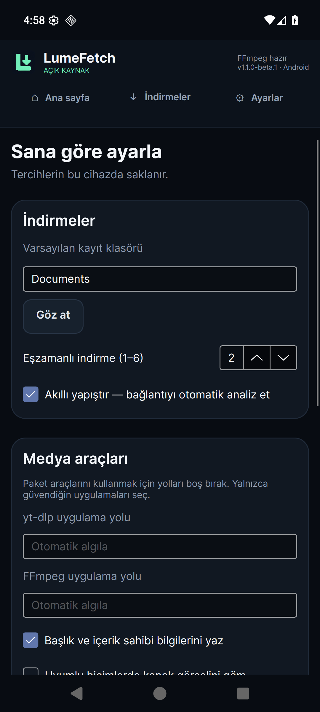

# LumeFetch


**One downloader. Many platforms. Open source.**

[Windows downloads](https://github.com/Ranbon-Kafa/LumeFetch/releases/tag/v1.0.0) ·
[Android APK (beta)](https://github.com/Ranbon-Kafa/LumeFetch/releases/tag/android-v1.1.0-beta.1) ·
[Website](https://ruzgarefe.com) · [Report an issue](https://github.com/Ranbon-Kafa/LumeFetch/issues)

Modern Windows and Android media download manager built with C#, .NET and Avalonia.
Maintained by **Ranbon-Kafa / ruzgarefe.com** and the LumeFetch contributors.

> Use only for media you own, are authorized to download, or whose terms permit
> downloading. LumeFetch does not bypass DRM, paywalls or authentication controls.

## v1.0

- Smart Paste, URL analysis, thumbnails, format and quality selection.
- MP3, native audio, video/audio merging, metadata and compatible cover art.
- YouTube playlists: select up to 200 entries and choose a batch quality.
- Managed queue: progress, speed, remaining time, pause/resume, cancel and retry.
- 1–6 parallel downloads, saved settings, Turkish and English interface.
- Installer and portable ZIP with **.NET, FFmpeg, ffprobe, yt-dlp and Deno included**.
  No separate tool installation or first-launch tool download is needed.


*Actual Avalonia render with labeled fixture data; not a live download.*

| Source | v1.0 support |
|---|---|
| Direct HTTP/media URL | Original file and MP3 conversion |
| YouTube / YouTube Music | Public single videos and playlists via yt-dlp |
| Instagram | Public single video/reel via yt-dlp |
| TikTok | Public single video via yt-dlp |
| X / Twitter | Single-video post via yt-dlp |
| Reddit | Single-video post via yt-dlp |
| Spotify | **Disabled** pending service-policy review |
| Facebook, Twitch, Vimeo | Backlog |

Social providers depend on changing upstream extractors and public-access rules.
Routing tests do not guarantee that a particular site's URL will work today.

## Download and use

### Android 1.1.0-beta.1

Download the **ARM64 APK** from the [Android release](https://github.com/Ranbon-Kafa/LumeFetch/releases/tag/android-v1.1.0-beta.1).
Android 8+ (API 26), 64-bit ARM; MP3 and MP4 were confirmed by the maintainer on
a Samsung Galaxy S25 Ultra / Android 16 with the build 7 runtime. This is the
first public Android **beta**, not a claim of full device/provider certification.
The developer diagnostics card is removed. FFmpeg, FFprobe, Python, yt-dlp and
QuickJS are already bundled; no first-launch tool download is required.

Choose a writable folder in Settings, save it, then paste/share an authorized URL.
The same playlist, format and queue commands are available with phone navigation.
Background work remains subject to Android limits; unfinished jobs reopen paused.
Spotify is disabled and iOS is on hold. See [test coverage and limitations](packaging/android/ACCEPTANCE.md).

**Migrating from a private test APK:** the public APK uses a new permanent signing
certificate. Android cannot update a debug-signed test installation with this key.
Finish/export important downloads before deciding to remove the test installation;
removal deletes private settings, history and unfinished files. No automatic removal
is performed. Future public updates will use the same permanent certificate.
Check `SHA256SUMS.txt` and the [public signing identity](packaging/android/SIGNING.md).



*Actual Android 16 emulator capture; phone acceptance is documented separately.*

### Windows 1.0.0

Get the installer or portable ZIP from [GitHub Releases](https://github.com/Ranbon-Kafa/LumeFetch/releases).
The installer is per-user and does not require administrator privileges. For
portable use, extract the **entire ZIP** before opening `LumeFetch.exe`.

**v1 is unsigned.** Windows may show a SmartScreen warning. Check the publisher's
release URL and `SHA256SUMS.txt`; do not disable your security software. The
runtime self-check is available as `LumeFetch.exe --self-check`.

Paste an authorized URL, select a format, choose the save folder and enqueue.
For playlists, select entries and quality, confirm download permission and enqueue.
Unavailable entries are reported individually; one failure does not stop the rest.

MP3 uses high-quality variable bitrate, not a fixed 320 kbps promise. It cannot
improve the original recording. Conversion size is unknown until processing.

## Settings


Choose a folder, parallelism, Smart Paste, metadata/cover embedding and TR/EN.
Click **Save settings** to persist preferences. Tool path and embedding changes
take effect after restart. Installed settings are in
`%LOCALAPPDATA%/LumeFetch/settings.json`; portable settings are in `data/settings.json`.
Tools can be replaced with trusted compatible builds through Settings.

## Build and verify

The application requires the .NET 10 SDK. Windows binaries target x64. Linux/macOS
source builds are architectural targets, not tested or packaged v1 releases.

Android is distributed separately as a beta ARM64 APK. The shared UI adapts to
phone widths without removing desktop commands. See [Android build instructions](packaging/android/NATIVE-BUILD.md)
and [mobile architecture and limitations](docs/MOBILE.md). No iOS app is available.

```powershell
dotnet restore LumeFetch.sln
dotnet build LumeFetch.sln -c Release
dotnet test LumeFetch.sln -c Release
dotnet run --project src/LumeFetch.Desktop
```

For bundled Windows tools, install MSYS2 with MinGW64 GCC, make and pkgconf, plus
Python 3.11+ for source collection. The build work directory must be ASCII without
spaces. Build-time internet access is required; these steps are for developers.

```powershell
./scripts/Get-WindowsTools.ps1 -IncludeInstallerCompiler
./scripts/Build-FFmpeg.ps1 -MsysRoot C:/msys64 -WorkDirectory C:/Temp/lumefetch-build
python scripts/collect-third-party.py
./scripts/Test.ps1 -IncludeMediaSmoke
./scripts/Publish-Windows.ps1
```

Artifacts are placed in a new timestamped `artifacts/releases` directory. Publish
the corresponding-source archive with every binary distribution. See
[third-party notices](THIRD_PARTY_NOTICES.md) and [release verification](docs/VERIFICATION.md).

## Architecture and contribution

`Core` owns provider/resolver contracts, matching, media models and the download
manager. `Infrastructure` implements HTTP transfers and external tool adapters.
`Presentation` owns the shared Avalonia views, view models and localization bindings;
it references only `Core` and portable Avalonia packages. `Desktop` composes the
services and hosts that same view in a window. yt-dlp and FFmpeg
are backend processes; queue ownership, state, error handling and UX belong to
LumeFetch. See [architecture](docs/ARCHITECTURE.md) and [CONTRIBUTING](CONTRIBUTING.md).

Spotify authentication and resolution are **not registered in v1**. Experimental
code/tests remain for future review, with no hidden enable switch. A successful
login does not imply service approval. See [Spotify decision](docs/SPOTIFY.md).

## Known limits

- No DRM, login cookies, private media, live broadcasts, profiles or carousels.
- HTTP byte resume requires a strong ETag and valid range support; otherwise it
  safely restarts. yt-dlp resumes where its backend permits.
- Windows v1 queue history is in memory. The Android development host adds private
  queue/history recovery after process death; see [mobile status](docs/MOBILE.md).
  Partials under `.lumefetch/<job-id>` in the chosen folder survive cancellation
  and uninstall; remove only unneeded job folders after closing the application.
- Automatic updates, dynamic plugin loading and Linux/macOS installers are future work.
- Windows Server installation automation is not Windows 10/11 interactive,
  SmartScreen, screen-reader or high-DPI certification. See the
  [release checklist](docs/RELEASE-CHECKLIST.md) for tested and untested scope.

## License

[MIT](LICENSE), copyright © 2026 **Ranbon-Kafa (https://ruzgarefe.com)** and
LumeFetch contributors. The website identifies the maintainer; it adds no payment,
registration, non-commercial-only or backlink requirement to MIT.

Bundled tools retain their own licenses, including LGPL/GPL components. The
application's MIT license does not relicense them. Logo and cover production notes
are in [docs/branding](docs/branding); artwork is not a trademark clearance.
